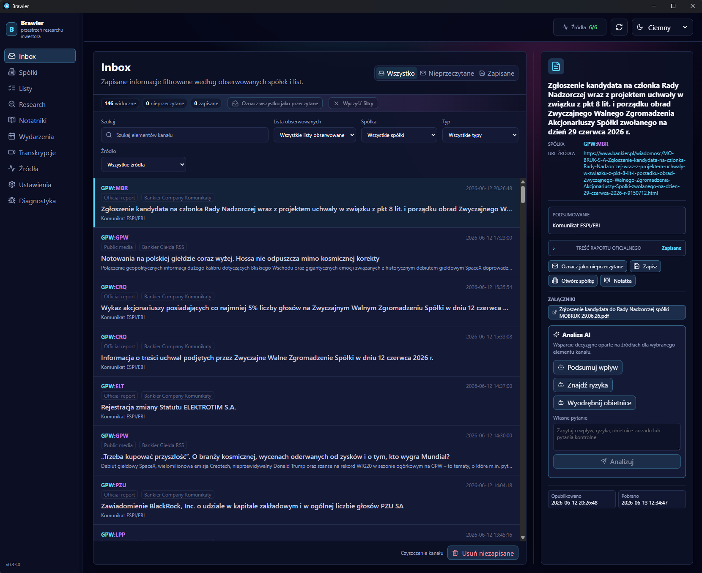

<div align="center">

# 🥊 Brawler

### Your investor research, in your corner — and on your machine.

Company news, watchlists, source-backed notes, and AI decision support
that **never leaves your computer**.

[](LICENSE)


</div>

<p align="center">
  
</p>

---

Brawler pulls company news and filings into one place, lets you organize research around the companies you follow, and uses AI — **with your own API key** — to summarize and cross-reference what you read. It is a desktop app first, with Windows as the primary target.

It is for personal research and decision support. It is **not** a trading platform, portfolio tracker, or recommendation engine — it will never tell you to buy, sell, hold, or bet the mortgage. That part is still gloriously, terrifyingly up to you.

## ✨ What Brawler Does Today

| | |
|---|---|
| 📰 **Inbox** | One feed of Polish-market (GPW) news and filings via official + RSS sources (Bankier market news, company *komunikaty*, GPW market events) — deduplicated and matched to your companies. |
| 🏢 **Companies & Watchlists** | A company registry with a per-company workspace, plus watchlists to group what you follow. |
| 🔬 **Research Workspace** | Research questions, evidence timelines, AI briefs and digests, and event-aware reminders that resurface follow-ups on time. |
| 📓 **Notebooks** | Markdown notes, claims, and follow-ups linked to companies. |
| 🤖 **AI Analysis (BYO key)** | Summaries, significance, briefs, and digests — always cited, always framed as decision support. Gemini today; Claude & OpenAI next. |
| 🎙️ **Transcripts** | Turn source media (e.g. YouTube) into searchable transcripts in your research corpus. |
| 📊 **Fundamentals** *(early)* | Financial periods, canonical + custom-per-company KPIs, manual KPI entry against report evidence. AI extraction & charts are on the way. |
| 📅 **Events** | Track upcoming and past company events. |
| 🌍 **Bilingual UI** | English and Polish. |

Everything lives in a local SQLite database; secrets stay in the OS keychain. See the **[roadmap](docs/kanban.md)** for what is cooking next.

## 🔒 Privacy

Local-first, by default. Your research stays yours:

- tracked companies, watchlists, feed items, notes, settings, and AI outputs stay on your machine
- secrets are stored through the operating-system keychain
- no cloud accounts, hosted activation, telemetry, or remote entitlement checks for core use
- AI/provider integrations are explicit, user-configured workflows

No analytics, no "we value your privacy" cookie banner, no mystery server quietly taking notes on your portfolio.

## 📥 Download

Pre-1.0 builds are published on **[GitHub Releases](https://github.com/wbednarczyk/brawler/releases)** as a binary mirror. Windows 10/11 is the primary target. The portable Windows candidate is unsigned and may show Windows trust prompts — see [Portable Windows Candidate](#-portable-windows-candidate).

Prefer to build it yourself? Jump to [Build & Test](#%EF%B8%8F-build--test).

## Source & Forge Policy

**Radicle is the canonical public forge. GitHub is a read-only mirror and backup.**

- RID: `rad:z3yTYrLFsFx5qcPtV3XiFYFBpQWuh`
- Public seed: `seed.mikolajczyk.org:8776`

Use Radicle for issue and patch workflow; use GitHub for browsing, downloads, and backup.

## 🛠️ Build & Test

Brawler uses Nix for the development environment.

```bash
nix develop
npm install
npm run check
make release-check
```

Handy local commands:

```bash
npm run dev
npm run test
npm run test:browser
make package-windows-from-linux
```

Full local workflow → [Engineering Workflow](docs/engineering-workflow.md).

## 🪟 Portable Windows Candidate

Build from WSL:

```bash
make package-windows-from-linux
```

Run the copied candidate:

```bash
make package-windows-smoke-run
```

Default output:

```text
D:\Brawler\Builds\latest\brawler-<version>-windows-x64-portable.exe
```

Portable runtime data is stored in a `data` folder next to the executable.

- Windows 10/11 are the target platforms for the portable candidate.
- The executable is unsigned, so Windows will give it the suspicious side-eye and a trust prompt or two. (Pre-1.0 life.)
- It relies on the system WebView2 runtime.
- Secrets stay in the OS keychain and may need re-entry after moving the portable folder to another machine.

Manual checklist → [Packaging Smoke Tests](docs/packaging-smoke-tests.md).

## 🚧 Status

Brawler is pre-1.0 software — the codebase changes actively and the data model still occasionally rearranges the furniture between releases.

The core desktop app is open source under the **Mozilla Public License 2.0**. Future hosted services, premium integrations, official distribution infrastructure, or support offerings may be licensed separately.

## Documentation

Canonical docs live in **[docs/](docs/)**:

- [Architecture](docs/architecture.md) — runtime boundaries and module layout
- [Engineering Workflow](docs/engineering-workflow.md) — build, test, CI, packaging
- [Data Model](docs/data-model.md) & [Contracts](docs/contracts.md) — schema and command surface
- [Roadmap](docs/kanban.md) — milestones and active tracking

## Contributing

See [CONTRIBUTING.md](CONTRIBUTING.md). Contributions are welcome once the public contribution process is active; project direction stays maintainer-led.

## Maintainer

Built and maintained by **Wojciech Bednarczyk**. See [MAINTAINERS.md](MAINTAINERS.md).

## Security

See [SECURITY.md](SECURITY.md) for supported reporting rules.

## License

Brawler is licensed under the [Mozilla Public License 2.0](LICENSE).
